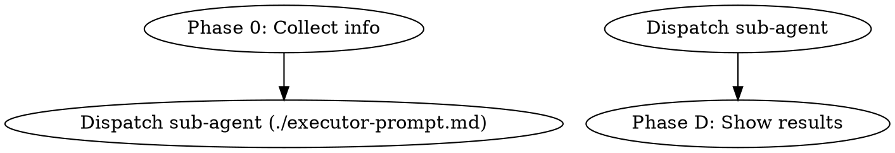

复杂 Skill 最容易失败的地方，不是步骤写得不够细，而是主 agent 在收集信息、执行任务、处理中间状态时把上下文搅在一起。一个更稳的做法是：==先收集，再分派==。

这篇文章记录一种适合 [[Claude Code]] 的 Skill 设计模式：主 agent 只负责轻量的信息收集和用户交互，真正的长链路执行交给 sub-agent。它可以和 [[How to write good agent skills]]、[[Agent Skills 构建指南]] 里的基础设计原则配合使用。

## 问题背景

在 Claude Code 里处理复杂任务时，常见问题有三个：

- AI 在收集信息和执行任务之间来回跳跃，上下文越来越乱。
- 一个 Skill 跑到一半，主 agent 因为上下文过长开始丢失早期信息。
- 有些步骤需要与用户交互，有些步骤需要大量文件读写，混在同一个 session 里很难协调。

这些问题本质上都是上下文边界不清。主 agent 既要理解用户意图，又要深读文件，还要执行修改和汇报结果，最后整个 session 会变成一锅很难维护的状态。

## 从 Superpowers 学到的设计原则

[[Superpowers - 流行的 Claude 插件包]] 的一个关键设计哲学是：每个 Skill 只做一件事，复杂工作通过 sub-agent 分派完成。

以 `subagent-driven-development` 为例，它的流程可以抽象成这样：

```text
Controller（主 agent）
  ├── 读取 plan，提取所有任务
  ├── 创建 TodoWrite 跟踪进度
  └── 对每个任务：
        ├── 分派 Implementer sub-agent（实现）
        ├── 分派 Spec Reviewer sub-agent（规格合规检查）
        └── 分派 Code Quality Reviewer sub-agent（代码质量检查）
```

这里有三条值得复用的规则：

1. sub-agent 不继承主 session 的上下文；controller 把任务需要的所有信息显式注入 prompt。
2. 每个角色使用独立的 prompt 模板文件，例如 `implementer-prompt.md`、`spec-reviewer-prompt.md`。
3. sub-agent 用标准状态码回报，例如 `DONE`、`DONE_WITH_CONCERNS`、`NEEDS_CONTEXT`、`BLOCKED`。

这三条规则解决的是同一个问题：大型任务需要上下文隔离。主 agent 不应该把所有细节都吞进来，它更适合做 controller。

## 一个改造案例：agent-docs-creator

`agent-docs-creator` 原本是一个线性流程，所有步骤都在主 agent session 里执行：

```text
Step 1: 探索项目结构（大量文件读取）
Step 2: 确定模块划分
Step 3: 生成文档（写多个文件）
Step 4: 同步 AGENTS.md
```

这种做法的问题很明显：主 agent 在信息收集阶段已经读入了大量源文件内容，等到真正开始写文档时，早期读到的信息可能已经被压缩、稀释或遗忘。

改造后的结构把流程拆成三段：

```text
Phase 0（主 agent）      Phase 1（sub-agent）         Phase D（主 agent）
───────────────────      ───────────────────          ────────────────────
ls -1 根目录             深读源文件                    展示结果
cat package.json         确定模块划分                  后续对话
检测 create/update 模式  生成 agent_docs/*.md
确认 AGENTS.md 路径      更新 AGENTS.md
       │                        │
       └──── Agent tool ─────────┘
```

Phase 0 的任务非常轻：通过几条 `ls` 和 `cat` 命令收集参数，确定运行模式、项目路径和目标文件。它不负责真正读懂项目，只负责让 sub-agent 可以无交互地开始工作。

sub-agent 拿到清晰输入后，用完整上下文容量深读源码、生成文档和更新相关文件。Phase D 则只接收结果、展示摘要，并给后续对话留下入口。

这个改造也改变了 `SKILL.md` 的职责。改造前，`SKILL.md` 同时包含 controller 的决策逻辑和 executor 的执行细节；改造后，两者拆开：

```text
agent-docs-creator/
├── SKILL.md              # controller 流程
└── executor-prompt.md    # sub-agent 完整指令
```

`SKILL.md` 变成调度脚本，读起来更像流程图。真正的执行细节放在 `executor-prompt.md` 中，由 controller 填入参数后分派给 sub-agent。

## 三段式 Skill 架构

这个模式可以概括为三段：Phase 0 收集信息，Sub-agent Execution 执行任务，Phase D 接收结果。

### Phase 0：信息收集

Phase 0 由主 agent 执行，目标是收集所有不确定信息，让 sub-agent 能无交互地完成工作。

典型内容包括：

- 检测环境，例如工具是否安装、环境变量是否存在。
- 确定运行模式，例如 `create` / `update`、`daily` / `weekly`、是否带 flag。
- 快速文件扫描，例如 `ls`、`cat package.json`，但不做深读。
- 处理需要用户选择的交互。

> [!note] Phase 0 的边界
> Phase 0 不做实质性工作，只收集参数。它的产物是一组足够明确的上下文变量，而不是半成品执行结果。

### Sub-agent Execution：集中执行

执行阶段通过 Agent tool 分派。prompt 来自独立的 `executor-prompt.md` 模板文件，参数由 Phase 0 收集到的值替换。

一个典型的 sub-agent prompt 可以这样组织：

```markdown
## Context

（所有必要参数，从 Phase 0 注入）

## Your job

（分步骤的执行指令）

## Report format

- **Status:** DONE | DONE_WITH_CONCERNS | BLOCKED
- （结构化返回内容）
```

sub-agent 不应该中途询问用户。遇到无法解决的问题，它应该返回 `BLOCKED`，由主 agent 诊断根因、补充信息或请求用户决策。

### Phase D：接收结果

Phase D 由主 agent 执行，目标是处理 sub-agent 返回，并决定展示、后处理还是重跑。

| Status               | 处理方式                 |
| -------------------- | ------------------------ |
| `DONE`               | 展示结果                 |
| `DONE_WITH_CONCERNS` | 展示结果，并标注遗留问题 |
| `BLOCKED`            | 诊断根因，用户处理后重跑 |

这个阶段应该尽量薄。主 agent 不需要重新执行 sub-agent 的工作，只需要把执行结果翻译成用户能继续行动的信息。

## 适合哪些 Skill

根据多个 Skill 改造经验，这种模式最适合执行重、上下文重、交互边界清晰的工作流。

| Skill 特征             | 为什么适合                                            |
| ---------------------- | ----------------------------------------------------- |
| 执行阶段读取大量文件   | sub-agent 可以使用完整上下文，不受主 session 历史干扰 |
| 执行步骤多、耗时长     | 主 agent 从长链条中解放出来                           |
| 有明确参数可以预先收集 | Phase 0 能干净完成                                    |
| 执行阶段不需要中途交互 | sub-agent 可以全程无交互运行                          |

不适合的场景也很明确：

| Skill 特征                 | 为什么不适合                       |
| -------------------------- | ---------------------------------- |
| 核心价值是与用户交互式共创 | 这类任务需要主 agent 持续对话      |
| 执行阶段极短               | 分派协议的开销可能高于收益         |
| 纯 RAG 型回答问题          | 没有独立执行阶段，就不存在隔离收益 |

一个实用判断是：如果某个 Skill 的 `SKILL.md` 已经长到既像产品说明、又像执行手册、还像故障处理指南，就该考虑拆出 executor prompt 了。

## 文件组织约定

可以沿用这种目录结构：

```text
skill-name/
├── SKILL.md              # controller 流程，给主 agent 看的
├── executor-prompt.md    # sub-agent prompt 模板
├── scripts/              # 确定性脚本，供 sub-agent 调用
└── references/           # 大型参考文档，按需加载
```

`executor-prompt.md` 可以用 `[placeholder]` 标记需要替换的参数，controller 在分派前填入实际值。

## 可复用模板

`SKILL.md` 可以保留为一个短小的 controller 流程：

````markdown
---
name: my-skill
description: ...
---

# My Skill

**Announce at start:** "I'm using the my-skill skill."

## The Process



## Phase 0: Information Collection (controller)

**Step 0.1:** Collect required parameters.

**Step 0.2:** Dispatch executor sub-agent.
Read `./executor-prompt.md`, fill in `[placeholder]` values, dispatch via Agent tool.

## Handling Executor Status

**DONE:** Show results.

**DONE_WITH_CONCERNS:** Show results and concerns.

**BLOCKED:** Explain the blocker and ask for the missing decision or context.

## Phase D: Show Results (controller)

Summarize what changed and what the user can do next.
````

`executor-prompt.md` 则承载完整执行指令：

````markdown
# Executor Subagent Prompt Template

```text
Task tool (general-purpose):
  description: "..."
  prompt: |
    ## Context

    Working directory: [projectDir]
    Mode: [mode]
    Other params: [params]

    ## Your job

    Step 1: ...
    Step 2: ...

    ## Report format

    - **Status:** DONE | DONE_WITH_CONCERNS | BLOCKED
    - **Changed files:** ...
    - **Notes:** ...
```
````

## 小结

三段式架构的核心思想很简单：==交互归主 agent，执行归 sub-agent==。

它带来三个收益：主 agent 上下文更干净，sub-agent 执行质量更高，Skill 文件也更容易维护。

当你用 Claude Code 构建 Skill，遇到“这个 Skill 步骤太多、上下文太重”的信号时，可以优先考虑这种模式。它不是为了炫技地拆分代理，而是为了把控制流、执行流和用户交互重新放回各自该在的位置。
