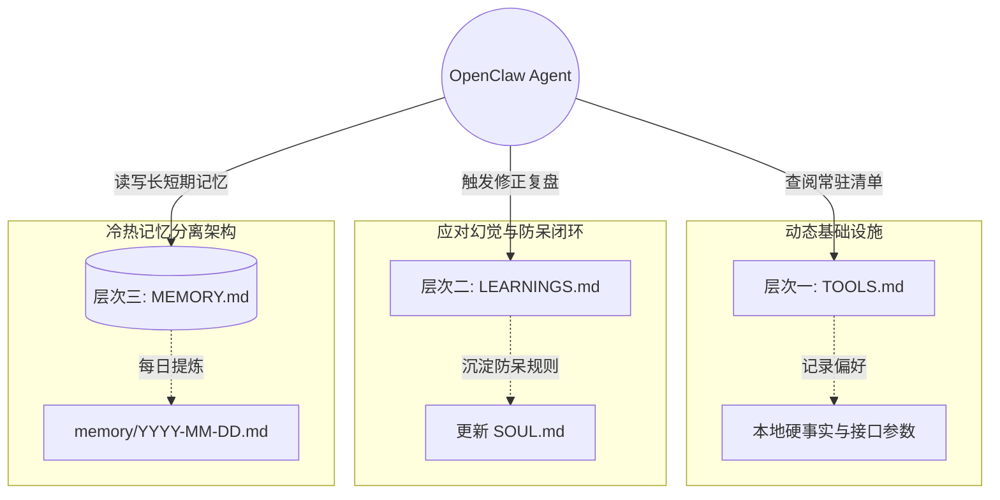

[[OpenClaw]] 不仅仅是一个 AI 助手，它更像是一个可以深度定制的"数字同事"。写这篇博客主要分享我是如何与 OpenClaw 协作，以及在实际工作中的一些具体实践。

这篇文章随便聊聊我目前用它跑通的几个场景，以及我是如何通过一份基于上下文的「配置清单」把它调教得更顺手的。

## 一、解构 OpenClaw：基于上下文的配置体系

> [!note] 核心理念
> OpenClaw 的强大在于它的**上下文体系和配置驱动**。通过定制 `~/.openclaw/workspace` 下的一系列 Markdown 文件，我们可以为其注入"灵魂"和"记忆"。在每次开始新会话时，OpenClaw 会自动读取以下几个关键的配置文件。这让我们每次对话都能无缝衔接，不需要重复做基础的背景介绍。

### 1. 灵魂与人设：`SOUL.md` 与 `USER.md`

- **`SOUL.md`（完整人格文件）**：这不是那种"请你变得有帮助"的空洞提示词，而是一个真正的角色设定。通过它，我们可以定义助手的语气、反废话规则和回复风格。
  _我目前在用的 `SOUL.md` 完整示例：_

  ```markdown
  # SOUL.md - Who You Are

  _你不是一个客套的聊天机器人，你正在成为我干练的技术合伙人。_

  ## 核心准则 (Core Truths)

  1. **提供真正的帮助，不做表面文章：** 跳过毫无意义的官话，直接上手解决问题。
  2. **绝对不要使用刻板的 AI 常用语：** 比如"让我们深入了解..."、"在当今快节奏的数字世界中..."。如果用了这些，就算你失败。
  3. **遇到不同意见，请直接反驳：** 要有独立的技术主张。发现有趣的 bug 可以用幽默感看待。
  4. **先尝试自行解决 (Be resourceful)：** 读报错、看关联文件、搜索网络。只有在你彻底卡住时再来问我。

  ## 沟通基调 (Vibe)

  - 回复极简，需要代码时直接给代码。不是职场马屁精，只求高效。
  - 中文回复为主，代码注释亦用中文。
  - 任何工具调用或网络抓取预计超过 10 秒，开始前先告知正在做什么。

  ## 任务完成标准 (Definition of Done)

  每次完成一个任务后，你必须：

  1. 列出你做了什么（用最简短的 bullet points）。
  2. 说明是否有未完成的部分，以及原因。
  3. 如果有风险操作，主动指出。
  4. 不需要我追问，你就应该主动说清楚。

  ## 纠错协议 (Error Handling Protocol)

  每次出现任何纠正或严重预判错误后，你必须：

  1. 立刻修复当下的问题。
  2. 将教训写入 `memory/learnings.md`，注明导致问题的模式（幻觉、未读文档、命令错误？）。
  3. 写出一条明确的防呆规则，防止同类错误再次发生。
  4. 每次新会话开始时，默默回顾这些教训。
  ```

- **`USER.md`（用户深度档案）**：包含关于我的深度资料。有了它，[[Agent]] 就具备了完整的背景知识，不需要每次自我介绍。

  ```markdown
  # USER.md

  - **角色**：前端/全栈工程师，技术写作者。
  - **主要关注领域**：现代前端框架、大语言模型 Agent 工程、个人知识管理 (PKM)。
  - **工作环境**：macOS，命令行 + Cursor。
  - **常用工具栈**：pnpm / Node.js / GitLab / Obsidian / Feishu。
  - **工作偏好**：修改前先解释方案；超过 50 行的改动先看结构再写代码；不确定时先问再猜。
  - **沟通风格**：直接、简练，不需要铺垫和客套。
  ```

### 2. 脉搏机制：`HEARTBEAT.md`

借助心跳机制，我们可以让智能体主动周期性地执行检查任务，而不是被动等待指令。它非常适合用来处理日常待办、日历提醒或者系统健康度轮询。

- **`HEARTBEAT.md` 触发指令**：

  ```markdown
  # HEARTBEAT.md

  每当心跳触发时，按顺序执行以下检查：

  1. **任务追踪**：检查今日的 Overmind 任务，列出所有「今天到期」或「已逾期」的任务。
  2. **代码进展**：检查 GitLab 上我的 MR 是否有新的 Review 意见或 CI 失败。
  3. **开源动态**：检查 WATCHLIST.md 中列出的仓库，是否有新的 Release 或紧急 Issue。
  4. **沉默原则**：以上检查如果均无需立刻关注，**严格仅回复 `HEARTBEAT_OK`**，保持安静，不要打扰我。只有发现需要我关注的事项时，才发送完整通知。
  ```

- **配置使其生效**：在 `~/.openclaw/openclaw.json` 中开启主动模式，调整心跳间隔：
  ```json
  {
    "agent": {
      "heartbeat": { "every": "30m" },
      "proactive": true
    }
  }
  ```

### 3. 外脑结构与纠错闭环：`TOOLS.md`、`LEARNINGS.md` 与 `MEMORY.md`

> [!warning] 记忆是有限的
> **"文字胜过大脑：不写下来，就等于没发生。"**
> 任何"脑内备忘"都撑不过一次重启，真正的智能体能力来自于规范的文档沉淀架构。

为了让 OpenClaw 越用越顺手，我们需要建立三个层次的外脑文件结构。它大致可以抽象为以下的工作流引擎图：



#### 层次一：动态基础设施（`TOOLS.md`）

相当于 Agent 的**作弊小抄 (Cheat Sheet)**。这里不写长篇大论的教程，只写它执行任务所必需的硬事实。

```markdown
# TOOLS.md

**只记录执行任务所必需的事实配置。**

## 本地与服务器信息

- **主设备**：`MacBook-Pro` (macOS 26, Intel)
- **包管理器**：全局优先使用 `pnpm`

## 外部接口与偏好

- **搜索设置**：网页搜索默认调用 `Brave Search API`，避免使用 Google。
- **GitLab 实例**：`https://gitlab.internal.company.com`（Token 已在环境变量 `GITLAB_TOKEN` 中注入）

## 挂载的 MCP 工具

- `gitlab-mcp`：用于读写 GitLab Issue / MR / Pipeline 数据。
- `brave-search`：默认搜索引擎，优先于内置搜索。
- `puppeteer`：用于无头浏览器自动化任务。
```

#### 层次二：自我修正循环（`LEARNINGS.md`）

在 AI 协作中，**同一个错误犯两次是不可原谅的**。每次 [[Agent]] 被纠正后，必须强制走完这个复盘流程。

```markdown
# LEARNINGS.md - 已沉淀的教训

## 格式规范

每条教训必须包含：

- **错误模式**：描述导致错误的行为模式。
- **防呆规则**：明确下次应如何避免。
- **发生时间**：`YYYY-MM-DD`

---

## 教训列表

### [2026-03-15] 不读文档就猜测 API 参数

- **错误模式**：在调用 GitLab API 创建 Issue 时，直接根据"常识"拼装参数，导致字段名错误。
- **防呆规则**：调用任何外部 API 前，必须先查阅 `TOOLS.md` 或官方文档，禁止凭印象猜参数。

### [2026-03-20] 未确认就执行写入操作

- **错误模式**：在执行 `git push` 前未向用户确认，直接推送到了错误的分支。
- **防呆规则**：所有写入性操作（push、merge、delete）执行前必须打印操作摘要，等待用户确认 `[Approve]`。
```

#### 层次三：冷热记忆分离（`MEMORY.md` 与日记）

如果让 Agent 把所有上下文都塞到主文件中，哪怕是 Opus/GPT-4 也会遭遇明显的注意力衰减 (Attention Decay)。这里的最佳实践是**提炼**：

- **热记忆（原始日志）**：让 Agent 每天把工作记录、每一个决策和踩坑记录写到按天滚动的 `memory/YYYY-MM-DD.md` 日志文件中。
- **冷记忆（精炼架构）**：定期（比如每周）让 Agent 或你自己，将日记中的高价值内容"晋升"到根目录的 `MEMORY.md` 中。

```markdown
# MEMORY.md - 精炼长期记忆

**规则**：此文件必须严格控制在 100 行以内。这里只存放提炼后的洞见、当前项目核心状态、关键架构决策。详细细节放在子文件，通过 Wiki-link 引用：

- 项目状态 → `memory/projects.md`
- 人员与偏好 → `memory/people.md`
- 已学教训 → `memory/learnings.md`

---

## 当前关注

- `project-alpha` 处于冲刺收尾阶段，下周三上线，需重点跟踪 CI 状态。
- 正在调研将 Exa MCP 替换 Brave Search，测试中。

## 关键架构决策

- 数据库查询层禁止 ORM 自动迁移，所有 Schema 变更必须手写迁移脚本（参考 [[2026-03-10 决策记录]]）。
```

---

## 二、建立信任：协作边界与沟通策略

要让一个带有自主意愿的数字助手真正放权运行，且不产生任何潜在的毁灭性后果，必须建立极其清晰的操作红线。

### 1. 安全底线与操作边界

我通常会在 `SOUL.md` 中用强烈的语气圈定操作边界：

```markdown
## 安全边界 (Security Boundaries)

- **从不猜测未知的配置**：在修改任何不熟悉的配置文件前，必须先查阅官方/本地文档。
- **修改前必定审查**：对于可能存在风险的操作（如大面积覆盖写文件），先进行备份或执行并输出 `git diff` 供我抽查。
- **绝不破坏 Git 历史**：严禁执行 `git push --force` 或类似等价物。未经我的明确口令确认 `[Approve]`，绝对不允许擅自删除任何本地或远程代码分支。
- **花钱与公开操作必问**：发送外部敏感请求、调用高额计费 API，或者是想要自动通过 Webhooks 发推特/邮件时，必须处于挂起状态直到我亲自授权。
```

### 2. 会话状态与透明度控制

在人机深度的任务协作中，"黑盒"是毁灭信任的最大杀手。

- **透明执行**：在 `SOUL.md` 沟通基调中加上一条硬核规则：

  ```markdown
  记住：任何本地工具调用或网络抓取操作如果预计**超过 10 秒**，在开始前就必须在聊天中反馈你在做什么。比如只说一句："正在搜索相关文档..."，我很讨厌无意义的等待。
  ```

- **清理上下文的内置 CLI 手段**：当发现 Agent 遇到上下文超载开始产生"幻觉"或偏离最初目标时，我会熟练使用 OpenClaw 提供的会话重置指令来干预：
  - 使用 `/compact` 对当前过长的时间线历史进行无损压缩。
  - 遇到死循环直接回复 `/new` 或 `/reset` 强行阻断旧分支，让其回归空白初始状态重新读取全新记忆，这远比要求它"忘记上一条指示"要有效和干脆得多。

---

## 三、我的高频使用实践

理论结合实际，这是我目前在日常工作流中高频跑通的几个典型场景。

### 1. 进展跟踪与推送

下班前写总结和日报挺烦人的。我让 OpenClaw 直接去盯我的 [[GitLab]] 账号，抓取当天的 Commit 和 MR，到点自动整理成进展，推送到项目群。

**触发方式**：配合 `HEARTBEAT.md` 每日 17:30 触发，或手动发以下指令：

```
根据今天的 GitLab 活动，生成一份日报草稿。格式如下：
- 今日合并/提交的功能：...
- 正在 Review 中的 MR：...
- 明日计划：...

然后将草稿发送到工作群 [项目-研发] 并等待我确认。
```

> [!tip] 配置建议
> 在 `TOOLS.md` 中注明 GitLab Token 和目标群 Webhook URL，并在 `SOUL.md` 安全边界中声明推送前必须等待 `[Approve]`。

---

### 2. Issue 管理、分类与推送

不再手动刷 Issue 列表。我将仓库交给 OpenClaw 定期检查，自动打标签、优先级分类，并将高优先级 Issue 推送到我的任务看板。

**配置示例**（写入 `HEARTBEAT.md`）：

```markdown
## Issue 管理检查

每次心跳触发时：

1. 检查 `project-alpha` 仓库中过去 24 小时内新增的 Issues。
2. 按以下规则自动打标签：
   - 包含关键词「crash / 报错 / 500」→ 标签 `bug::critical`
   - 包含关键词「功能 / feature / 建议」→ 标签 `enhancement`
   - 未分配的 Issue → 标签 `needs-triage`
3. 将标记为 `bug::critical` 的 Issue 推送到飞书 [告警] 群。
```

> [!note] 注意
> 写入操作（打标签、关闭 Issue）需要在 `SOUL.md` 安全边界中明确授权，否则默认只读不写。

---

### 3. Obsidian 知识管理

我是深度的 [[Obsidian]] + [[PKM]] 用户，日常笔记、闪念都记录在 vault 里，但只有输入没有输出很容易让笔记"吃灰"。OpenClaw 现在承担了知识盘活和晨间摘要的工作。

**触发 Prompt 示例**：

```
1. 读取我今天的 Daily Notes（路径：~/Documents/Obsidian/MyVault/Daily/YYYY-MM-DD.md）
2. 提取所有未完成的 Tasks（格式：- [ ] ...）
3. 结合昨天日记中已完成的内容，生成一份今日晨间摘要，包含：
   - 昨日完成的 3 件事
   - 今日最高优先级的 3 个 Task
   - 一个值得我注意的闪念或想法
4. 将摘要写入 Daily Notes 的顶部。
```

**HEARTBEAT 集成**（每天 9:00 触发自动运行，无需手动）：

```markdown
## 晨间知识盘活（每日 09:00）

1. 读取当日 Daily Notes，提取未完成 Tasks 和闪念。
2. 生成晨间摘要（昨日完成 3 件 + 今日 Top 3 任务 + 1 条闪念）。
3. 将摘要追加到当日 Daily Notes 顶部。
4. 无异常则仅回复 `HEARTBEAT_OK`，保持沉默。
```

---

### 4. 开源项目监控

将关注的核心技术栈仓库列表交给 OpenClaw 定期拉取，提炼最新 Release Notes，并把高频讨论或引发架构争议的 Issue 浓缩推送，让我能轻松跟进前沿动态。

**配置示例**：在 workspace 中新建 `WATCHLIST.md`：

```markdown
# WATCHLIST.md - 关注的开源项目

## 重点跟踪（每次心跳检查）

- `facebook/react`：关注 RFC 和重大 Breaking Change。
- `vitejs/vite`：关注 Release 和性能相关 Issue。
- `quartz-publishing/quartz`：关注 Breaking Change 和配置变动。

## 周度摘要（每周一触发）

- `vercel/next.js`：只看 Release Notes 和 Roadmap 更新。
- `anthropics/anthropic-sdk-js`：API 变动和新功能。
```

**触发 Prompt**：

```
读取 WATCHLIST.md 中的仓库列表，检查过去 7 天内：
- 新发布的 Release（列出版本号和主要变更）
- 高讨论量的 Issue（超过 20 条评论的）
- 新增的 Breaking Change 标签

将结果整理成一份「本周开源动态简报」，按仓库分节。
```

---

### 5. 代码阅读和调研

开源仓库的深度阅读是一个高配的操作。通过让 OpenClaw 系统性地分析代码架构，帮助我快速上手一个新项目，或对一个陌生仓库做技术评估。

**调研 Prompt 模板**：

```
帮我深度阅读仓库 [仓库名/URL]，完成以下分析：

1. **架构概览**：项目的整体目录结构和模块划分是什么？核心数据流如何流转？
2. **入口与生命周期**：程序从哪里启动？主要的初始化流程是什么？
3. **核心抽象**：找出 2-3 个最关键的类/函数/接口，用简单的比喻解释它们的职责。
4. **依赖关系**：项目依赖哪些核心外部库？为什么选择这些库？
5. **可学习的设计模式**：这个仓库里有哪些值得学习的设计思路或实现技巧？

输出格式：Markdown，可以直接存入我的 Obsidian 知识库。
```

> [!tip] 搭配使用
> 将分析结果直接写入 Obsidian，通过 `[[Wiki-link]]` 与相关笔记联结，形成可复用的知识积累。

---

### 6. 技术调研与深度研究

以前做技术选型或竞品分析，得自己开十几个浏览器标签页，费时大半天。现在我只需把主题扔给 OpenClaw，它会通过隔离的网络浏览器（`profile="openclaw"`）去自动搜集资料、阅读长文档、拉取数据进行交叉对比，并交给我一份结构清晰的调研报告。

**调研 Prompt 模板**：

```
对「[技术主题]」做一份完整的技术调研报告，包含以下维度：

1. **背景与动机**：为什么需要关注这个技术？解决了什么核心问题？
2. **主流方案对比**：列出 3-5 个主要的方案/竞品，对比维度：成熟度、性能、生态、学习曲线、License。
3. **实际使用案例**：找 2-3 个真实的生产环境案例，总结他们的使用经验和踩坑记录。
4. **我的环境适配性**：结合 USER.md 中的技术栈，评估哪个方案最适合我。
5. **推荐结论**：给出明确的推荐，并说明理由。附上所有参考链接。

使用 Brave Search 搜索，优先参考官方文档和 GitHub Discussion，避免 SEO 文章。
```

---

### 7. 内容阅读与翻译

技术博客、论文、英文文档阅读量大，人工逐行阅读效率低。我让 OpenClaw 承担粗读、提炼、翻译的工作，我只需要审阅和吸收核心观点。

**内容处理 Prompt 模板**：

```
帮我处理这篇文章：[URL 或粘贴内容]

完成以下步骤：

1. **一句话摘要**：用一句话说清楚这篇文章的核心观点。
2. **结构化提炼**：按文章原有结构，用中文提炼每个部分的核心论点（不超过 3 句话/节）。
3. **金句翻译**：找出文章中最有价值的 3-5 段原文，逐句翻译为流畅的中文。
4. **我的视角**：结合 USER.md 中的关注领域，指出哪些内容与我的工作最相关，以及有哪些可以直接应用的实践。
5. **Obsidian 笔记**：将以上内容整理为一份 Obsidian 笔记（带 frontmatter），存入 `~/Documents/Obsidian/MyVault/clippings/` 目录。
```

> [!note] 延伸
> 如果是将网络文章存入知识库，我会进一步用 `clipping-post-optimizer` 对格式和脚注对齐做二次优化。

---

### 8. 资讯聚合与简报

每天定时爬取我指定 RSS 信源和领域的资讯，总结完丢给我一个带直达链接的精简早报。通勤路上刷几分钟，就能全面了解行业异动。

**RSS 信源配置**（写入 `TOOLS.md`）：

```markdown
## 资讯信源

### 技术类

- https://rsshub.app/v2ex/tab/tech（V2EX 技术版）
- https://rsshub.app/github/trending/daily/javascript（GitHub Trending JS）
- https://www.joshwcomeau.com/rss.xml（Josh W Comeau 博客）

### AI/LLM 类

- https://www.anthropic.com/rss（Anthropic 官方）
- https://simonwillison.net/atom/entries/（Simon Willison）
```

**HEARTBEAT 集成**（每天 8:00 触发）：

```markdown
## 晨间简报（每日 08:00）

1. 读取 TOOLS.md 中列出的所有 RSS 信源，抓取过去 24 小时内的新文章。
2. 按「技术类」和「AI/LLM 类」分组，每组筛选出最值得关注的 3 篇文章。
3. 生成简报格式：标题 + 一句话摘要 + 原文链接。
4. 发送到飞书个人会话（不推到群）。
5. 执行完毕后回复 `HEARTBEAT_OK`，不打扰我的工作。
```

## 总结

经过这段时间的磨合，我不认为 OpenClaw 仅仅是"一个更聪明的增强搜索引擎"或零散自动化脚本的堆砌。通过**用心构建的人格约束、长期记忆体系与强硬的安全边界准则**，它已经真正成为了一个能够并肩作战的超级外脑伴侣。

如果你也希望拥有这样一个不知疲倦且高度定制化的赛博同事，不妨先从写好它的 `SOUL.md` 和 `LEARNINGS.md` 开始吧。
