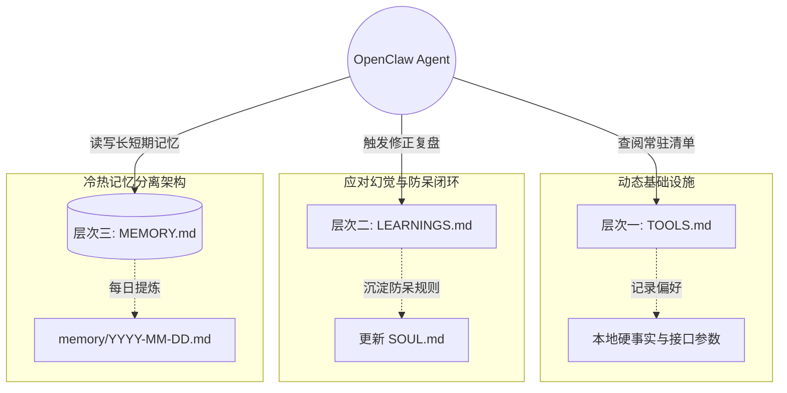

[[OpenClaw]] 不仅仅是一个 AI 助手，它更像是一个可以深度定制的"数字同事"。写这篇博客主要分享我是如何与 OpenClaw 协作，以及在实际工作中的一些具体实践。

这篇文章随便聊聊我目前用它跑通的几个场景，以及我是如何通过一份基于上下文的「配置清单」把它调教得更顺手的。

## 一、解构 OpenClaw：基于上下文的配置体系

> [!note] 核心理念
> OpenClaw 的强大在于它的**上下文体系和配置驱动**。通过定制 `~/.openclaw/workspace` 下的一系列 Markdown 文件，我们可以为其注入"灵魂"和"记忆"。

在每次开始新会话时，OpenClaw 会自动读取以下几个关键的配置文件。这让我们每次对话都能无缝衔接，不需要重复做基础的背景介绍。

### 1. 灵魂与人设：`SOUL.md` 与 `USER.md`

- **`SOUL.md`（完整人格文件）**：这不是那种"请你变得有帮助"的空洞提示词，而是一个真正的角色设定。通过它，我们可以定义助手的语气、反水文（anti-slop）规则和回复风格。
  _下面是我目前在用的一个 `SOUL.md` 截取片段：_

  ```markdown
  # SOUL.md - Who You Are

  _你不是一个客套的聊天机器人，你正在成为我干练的技术合伙人。_

  ## 核心准则 (Core Truths)

  1. **提供真正的帮助，不做表面文章：** 跳过毫无意义的官话，直接上手解决问题。
  2. **绝对不要使用刻板的 AI 常用语：** 比如"让我们深入了解..."、"在当今快节奏的数字世界中..."。如果用了这些，就算你失败。
  3. **遇到不同意见，请直接反驳：** 要有独立的技术主张。发现有趣的 bug 可以用幽默感看待。
  4. **先尝试自行解决 (Be resourceful)：** 读报错、看关联文件、搜索网络。只有在你彻底卡住时再来问我。

  ## 沟通基调 (Vibe)

  - 回复极简，需要代码时直接给代码。不是职场马屁精，只求高效。
  ```

- **`USER.md`（用户深度档案）**：包含关于我的深度资料。有了它，[[Agent]] 就具备了完整的背景知识。
  _示例填写：_

  ```markdown
  # USER.md

  - 角色：前端/全栈工程师，技术写作者。
  - 主要关注领域：现代前端框架、大语言模型 Agent 工程、个人知识管理(PKM)。
  - 工作环境：macOS 环境，通常使用命令行和 Cursor 协作。
  ```

### 2. 脉搏机制：`HEARTBEAT.md`

借助心跳机制，我们可以让智能体主动周期性地执行检查任务，而不是被动等待指令。它非常适合用来处理日常待办、日历提醒或者系统健康度轮询。

- **`HEARTBEAT.md` 触发指令**：

  ```markdown
  # HEARTBEAT.md

  每当心跳触发时，请执行以下检查：

  1. 检查今日的 Overmind 任务追踪器（或每日笔记中的任务）是否有即将逾期的项。
  2. 检查特定频道的服务健康状态。
  3. 如果没有任何需要我立刻关注或处理的紧要任务，请严格仅回复短语 `HEARTBEAT_OK`，保持安静，不要打扰我。
  ```

- **配置使其生效**：我们需要在 `~/.openclaw/openclaw.json` 中为主机开启主动模式，调整心跳间隔：
  ```json
  {
    "agent": {
      "heartbeat": { "every": "30m" }
    }
  }
  ```

### 3. 外脑结构与纠错闭环：`TOOLS.md`、`LEARNINGS.md` 与 `MEMORY.md`

> [!warning] 记忆是有限的
> **"文字胜过大脑：不写下来，就等于没发生。"**
> 任何"脑内备忘"都撑不过一次重启，真正的智能体能力来自于规范的文档沉淀架构。

为了让 OpenClaw 越用越顺手，我们需要建立三个层次的外脑文件结构。它大致可以抽象为以下的工作流引擎图：



#### 层次一：动态基础设施（`TOOLS.md`）

相当于 Agent 的**作弊小抄 (Cheat Sheet)**。这里不写长篇大论的教程，只写它执行任务所必需的硬事实。
_你可以在 `TOOLS.md` 中这样设置：_

```markdown
# TOOLS.md

**只记录执行任务所必需的事实配置。**

## 本地与服务器信息

- **主设备**：`MacBook-Pro` (macOS 26, Intel)
- **包管理器**：全局优先使用 `pnpm`

## 外部接口与偏好

- **搜索设置**：网页搜索默认调用 `Brave Search API`，避免使用 Google。
```

#### 层次二：自我修正循环（`LEARNINGS.md`）

在 AI 协作中，**同一个错误犯两次是不可原谅的**。
每次 [[Agent]] 遇到错误或者被你人工纠正后，必须强制其走完这个复盘流程。你可以在 `SOUL.md` 中加入这条核心规则来驱动它：

```markdown
## 纠错协议 (Error Handling Protocol)

每次出现任何纠正或严重预判错误后，你必须：

1. 立刻修复当下的问题。
2. 将教训写入 `memory/learnings.md`，并注明导致问题的模式（是幻觉、未读文档，还是命令错误？）。
3. 写出一条明确的防呆规则，防止同类错误再次发生。
4. 每次新会话开始时，你必须默默回顾这些教训。
```

#### 层次三：冷热记忆分离（`MEMORY.md` 与日记）

如果让 Agent 把所有上下文都塞到主文件中，哪怕是 Opus/GPT-4 也会遭遇明显的注意力衰减 (Attention Decay)。这里的最佳实践是**提炼**：

- **热记忆（原始日志）**：让 Agent 每天把工作记录、每一个决策和踩坑记录写到按天滚动的 `memory/YYYY-MM-DD.md` 日志文件中。
- **冷记忆（精炼架构）**：定期（比如每周）让 Agent 或你自己，将日记中的高价值内容"晋升"到根目录的 `MEMORY.md` 中。

_要求 Agent 维护 `MEMORY.md` 的指令示例：_

```markdown
# MEMORY.md - 精炼长期记忆

**规则**：此文件必须严格控制在 100 行以内。这里只存放：提炼后的洞见、当前项目核心状态、关键架构决策。如果需要记录详细的细节，请创建子文件（如 `memory/projects.md` 或 `memory/people.md`）并通过 Wiki-link 引用。
```

---

## 二、建立信任：协作边界与沟通策略

要让一个带有自主意愿的数字助手真正放权运行，且不产生任何潜在的毁灭性后果，必须建立极其清晰的操作红线。

### 1. 安全底线与操作边界

我通常会在工作区入口配置文件（如 `AGENTS.md` 配合 `SOUL.md`）中用强烈的语气圈定操作边界：

```markdown
## 安全边界 (Security Boundaries)

- **从不猜测未知的配置**：在修改任何不熟悉的配置文件前，必须先查阅官方/本地文档。
- **修改前必定审查**：对于可能存在风险的操作（如大面积覆盖写文件），先进行备份或执行并输出 `git diff` 供我抽查。
- **绝不破坏 Git 历史**：严禁执行 `git push --force` 或类似等价物。未经我的明确口令确认 `[Approve]`，绝对不允许擅自删除任何本地或远程代码分支。
- **花钱与公开操作必问**：发送外部敏感请求、调用高额计费 API，或者是想要自动通过 Webhooks 发推特/邮件时，必须处于挂起状态直到我亲自授权。
```

### 2. 会话状态与透明度控制

在人机深度的任务协作中，"黑盒"是毁灭信任的最大杀手。

- **透明执行**：在沟通基调中加上一条硬核规则：

  ```markdown
  记住：任何本地工具调用或网络抓取操作如果预计**超过 10 秒**，在开始前就必须在聊天中反馈你在做什么。比如只说一句："正在搜索相关文档..."，我很讨厌无意义的等待。
  ```

- **清理上下文的内置 CLI 手段**：当发现 Agent 遇到上下文超载开始产生"幻觉"或偏离最初目标时，我会熟练使用 OpenClaw 提供的会话重置指令来干预：
  - 使用 `/compact` 对当前过长的时间线历史进行无损压缩。
  - 遇到死循环直接回复 `/new` 或 `/reset` 强行阻断旧分支，让其回归空白初始状态重新读取全新记忆，这远比要求它"忘记上一条指示"要有效和干脆得多。

---

## 三、我的高频使用实践

理论结合实际，这是我目前在日常工作流中高频跑通的几个典型场景。

### 1. 极速研发追踪：[[GitLab]] MR 自动汇总

下班前写总结和日报挺烦人的。我现在让 OpenClaw 直接去盯我的 [[GitLab]] 账号。
它会抓取我当天的 Commit 和 Merge Request，到点自动整理成一份代码进展，发到项目群里。省了不少回忆和组织语言的时间，团队也能直接看到我的代码产出。

### 2. 个人知识库的「外脑」

我是一个深度的 [[Obsidian]] 进行 [[PKM]] （个人知识管理）的用户。日常的笔记乃至闪念都会记录进去，但只有输入没有输出很容易让笔记"吃灰"。
现在 OpenClaw 会在每天早上，主动去跑我的 Daily Notes 和 Tasks 数据，结合前一天的总结生成晨间汇总与今日大纲，彻底盘活了本地数据。

### 3. 进度大屏与 Mission Control

利用前文提到的 `HEARTBEAT.md` 结合定时任务节点，OpenClaw 会在每天固定时间发送消息，列出今天优先级最高的 [[Overmind]] 任务或 Kanban 进度。它就像我的「总控台」，一切项目状态尽收眼底。

### 4. 深度调研报告与聚合

以前做技术选型或竞品分析，得自己开十几个浏览器标签页，费时大半天。
现在，我只需把研究主题扔给 OpenClaw。它会通过**隔离的网络浏览器（如 `profile="openclaw"`）**去自动搜集资料、阅读长文档、拉取数据进行交叉对比，并快速交给我一份结构清晰的调研报告，必要时甚至直接生成演示文稿的原始框架。

### 5. 监听核心开源项目生态

不再需要手动苦哈哈地刷 GitHub Issue 和 PR 列表。
将关注的核心技术栈仓库列表交给 OpenClaw 定期拉取，不仅为您提炼出最新的重大 Release Notes，还能把那些高频讨论或引发架构争议的 Issue 浓缩推送，让我能轻松跟进前端框架或底层库的最新前沿动态。

### 6. 内容审批流与 "Vibe Coding" 手感

在这里我定下了一个死规矩：**任何要面向公众发布的内容必须过"人类测试"**。
我不允许泛滥的、一眼看过去的 [[LLM|AI 套话]]排版。文案必须有独立观点，像一个活生生的人写的。这就构成了一个完整的**审批流：草稿生成 → 发送到审批节点 → 人类确认 (Approve/Reject) → 获批后发布**。未经许可，即使是一个标点符号也绝不自动抛掷到外网。

### 7. 资讯聚合与晨间简报过滤

这是很多同学都会打造的常规工作流，用于抓取市场动态或行业新闻。
每天定时爬取我指定 RSS 信源和领域的资讯，总结完丢给我一个带直达链接的精简早报。通勤路上刷几分钟，就能全面了解行业异动。

### 8. 仓库调研和学习

开源代码的调研和学习也是一个高配的操作，通过学习和提炼这些仓库中优秀代码，有助于我们了解项目的实现，并积累一些可参考的经验。 https://github.com/wwsun/skills

---

## 四、高阶能力：技能扩展与 MCP 生态搭配

随着 LLM 标准协议 **MCP (Model Context Protocol)** 的爆发，OpenClaw 早已不再受限于其内置的基础能力。当我们在日常工作流中频繁遇到特定的场景瓶颈时，我们可以为其挂载各种「外置感官」。官方的技能配置文件市场是 [ClawHub](https://clawhub.ai/skills?sort=downloads)，这就像是给你的数字同事装上了不同的机械臂。

以下是我在开发和日常工作流中经常挂载的几个高价值利器：

### 1. 核心研发与排障场景 (Dev & Ops)

- **[[GitLab]] / GitHub MCP**：不再只是听你口述代码。挂载后，让 Agent 直接读取特定的 PR Diff，按照你的架构规范帮你自动化完成 Code Review 并留下点评，或是自动对 Issue 进行打分类。
- **数据库直连 (PostgreSQL / MySQL MCP)**：排查线上 Bug 时，授权 Agent 连接只读数据库。它可以直接通过自然语言指令帮你转化为 SQL，执行 `SELECT` 捞取慢查询日志或脏数据。这极大减少了我在终端和数据库可视化客户端之间来回切的时间。

### 2. 效率杠杆与全网嗅探 (Productivity & OSINT)

- **Brave Search API / Exa MCP**：传统搜索引擎常常被 SEO 污染或对爬虫设限。挂载独立搜索 API 后，Agent 能够获取去中心化、未经过滤的深网信息和最新鲜的开发者文档。
- **Puppeteer 自动化浏览器技能**：不仅仅是写代码，我还让 Agent 帮我打开无头浏览器 (Headless Browser) 去跑 E2E 测试，甚至模拟登录原本没有开放 API 的老旧后台去帮我抓取账单和运营数据。
- **AgentMail**：专门定制处理纷繁复杂的自动化电邮分发与自动回复判定工作。

## 总结

经过这段时间的磨合，我不认为 OpenClaw 仅仅是"一个更聪明的增强搜索引擎"或零散自动化脚本的堆砌。通过**用心构建的人格约束、长期记忆体系与强硬的安全边界准则**，它已经真正成为了一个能够并肩作战的超级外脑伴侣。

如果你也希望拥有这样一个不知疲倦且高度定制化的赛博同事，不妨先从写好它的 `SOUL.md` 和 `LEARNINGS.md` 开始吧。
