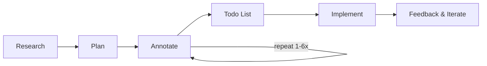
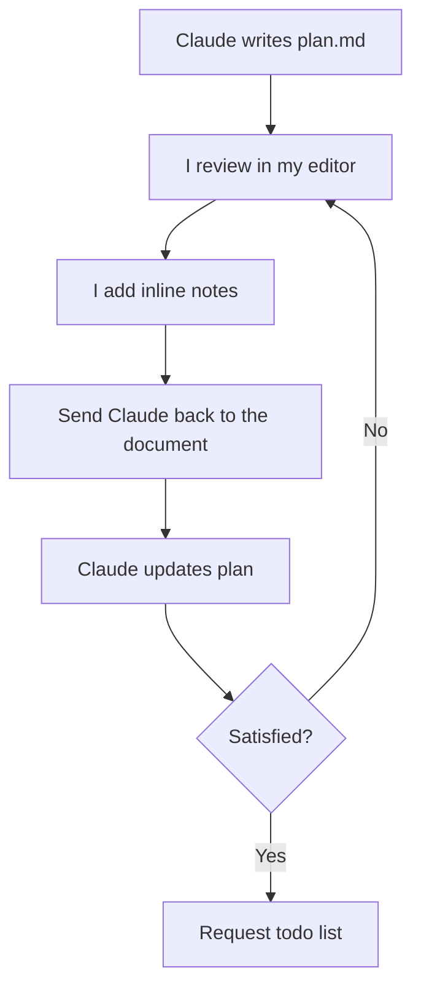
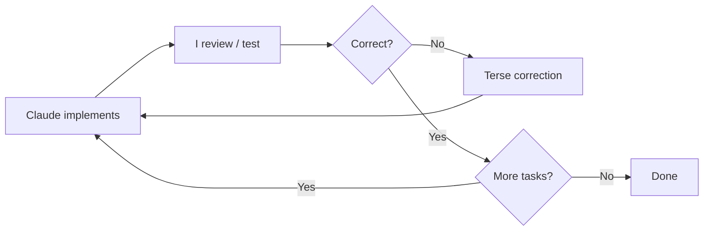
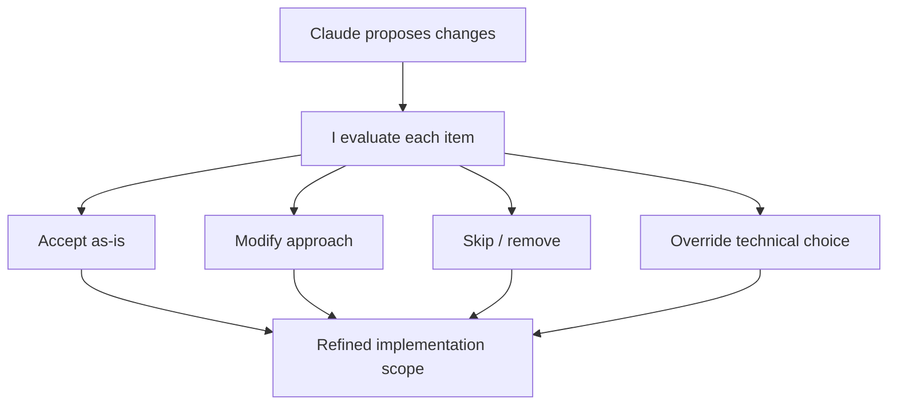

我使用 [Claude Code](https://docs.anthropic.com/en/docs/claude-code) 作为主要开发工具已有大约 9 个月了，我所形成的这种工作流与大多数人使用 AI 编程工具的方式截然不同。大多数开发者只是输入一段提示词，有时用一下计划模式，修复错误，然后重复。那些更沉迷于网络的人则在拼凑 ralph loops、MCP、gas towns（还记得那些吗？）等等。在这两种情况下，结果都是一团糟，一旦遇到非琐碎的任务就会彻底崩溃。

我将要描述的工作流遵循一个核心原则：==在审阅并批准书面计划之前，绝不让 Claude 编写代码。==这种计划与执行的分离是我所做的最重要的一件事。它能防止徒劳无功，让我掌控架构决策，并且与直接开始编码相比，能以极少的 Token 消耗产生显著更好的结果。

## 第一阶段：研究

每一个有意义的任务都始于一个“深度阅读”指令。在执行任何操作之前，我会要求 Claude 彻底理解代码库的相关部分。并且我始终要求将发现的结果写入一个持久化的 Markdown 文件中，而不仅仅是在对话中进行口头总结。

> 深入阅读此文件夹，透彻理解其工作原理、功能及所有特性。完成后，在 research.md 中编写一份详细的学习心得和调查报告。

> 深入研究通知系统，理解其复杂细节，并编写一份详尽的 research.md 文档，涵盖关于通知工作原理的所有知识。

> 梳理任务调度流程，深入理解并寻找潜在的 Bug。系统中肯定存在 Bug，因为有时它会运行本应被取消的任务。持续研究该流程，直到找到所有 Bug 为止，在找到所有 Bug 之前不要停止。完成后，在 research.md 中编写一份详细的调查报告。

Notice the language: **“deeply”**, **“in great details”**, **“intricacies”**, **“go through everything”**. This isn’t fluff. Without these words, Claude will skim. It’ll read a file, see what a function does at the signature level, and move on. You need to signal that surface-level reading is not acceptable.  

注意这些用词：“深入地”、“非常详细地”、“复杂之处”、“梳理所有内容”。这并非废话。如果没有这些词，Claude 会走马观花。它会读取一个文件，在函数签名层面了解其功能，然后就继续下一步。你需要发出信号，表明浅层阅读是不可接受的。

==书面产出物（ `research.md` ）至关重要。这并不是为了让 Claude 做作业，而是我的审核界面。我可以阅读它，验证 Claude 是否真正理解了系统，并在任何规划开始前纠正误解。如果调研错了，计划就会错，实施也会错。垃圾进，垃圾出。

这是 AI 辅助编程中最代价高昂的失败模式，而且它指的并不是错误的语法或糟糕的逻辑。它是指那些在孤立状态下运行良好，却破坏了周围系统的实现。比如：一个忽略了现有缓存层的函数；一个未考虑 ORM 约定的迁移；一个重复了已存在逻辑的 API 端点。调研阶段可以防止所有这些问题的发生。

## 第二阶段：规划

一旦我审阅完调研结果，我会要求在一个单独的 Markdown 文件中提供详细的实施计划。

> 我想构建一个新功能 <名称和描述>，以扩展系统来实现 <业务成果>。请编写一份详细的 plan.md 文档，概述如何实现此功能，并包含代码片段。

> 列表接口应支持基于游标（cursor-based）的分页，而非偏移量（offset）分页。请编写一份详细的 plan.md 说明如何实现这一点。在建议更改前先阅读源文件，并根据实际代码库制定计划。

> Make a plan first.

生成的计划始终包含对方案的详细解释、展示实际更改的代码片段、将被修改的文件路径，以及相关考量和权衡。

==我使用自己定义的 `.md` 计划文件，而不是 Claude Code 内置的计划模式。内置的计划模式很糟糕。我的 Markdown 文件能让我拥有完全的控制权。==我可以在编辑器中编辑它，添加行内注释，并且它会作为项目中的真实产物持久保存。

==我经常使用的一个技巧是：对于那些功能独立、且我在开源仓库中见过优秀实现的特性，我会将那段代码作为参考，连同计划请求一起分享。如果我想添加可排序 ID，我会从一个做得很好的项目中粘贴 ID 生成代码，并说“这是他们实现可排序 ID 的方式，写一个 plan.md 解释我们如何采用类似的方法。”当 Claude 有具体的参考实现可以借鉴，而不是从零开始设计时，它的表现会显著提升。

但计划文档本身并不是最有趣的部分。有趣的是接下来发生的事情。

## The Annotation Cycle

**注释循环**

这是我工作流程中最独特的部分，也是我创造价值最多的环节。

==在 Claude 编写完计划后，我会将其在编辑器中打开，并直接在文档中添加行内注释。这些注释用于纠正假设、拒绝某些方案、增加约束条件，或提供 Claude 所不具备的领域知识。

这些笔记的长度差异巨大。有时笔记只有两个词：在 Claude 标记为可选的参数旁边写上“非可选”。有时则是一个段落，解释业务约束或粘贴一段代码片段，展示我期望的数据形状。

以下是我会添加的一些真实注释示例：

- “使用 drizzle:generate 进行迁移，不要用原始 SQL” —— 这是 Claude 不具备的领域知识
- “不 —— 这里应该是 PATCH，而不是 PUT” —— 纠正错误的假设
- “完全删除这一部分，我们这里不需要缓存” —— 拒绝提议的方案
- “队列消费者已经处理了重试，所以这里的重试逻辑是多余的。删除它，直接让它失败即可” —— 解释为什么要进行更改。
- “this is wrong，可见性字段需要放在列表本身，而不是单个项目上。当列表公开时，所有项目都是公开的。请相应地重构架构部分”——重定向计划中的整个章节

然后我让 Claude 回到文档中：

> I added a few notes to the document, address all the notes and update the document accordingly. don’t implement yet  
> 我在文档中添加了一些注释，请处理所有注释并相应地更新文档。先不要实现代码。

**This cycle repeats 1 to 6 times.** The explicit **“don’t implement yet”** guard is essential. Without it, Claude will jump to code the moment it thinks the plan is good enough. It’s not good enough until I say it is.  
==**这个循环会重复 1 到 6 次。明确的“先不要实现”指令至关重要。** 如果没有它，Claude 一旦认为计划足够好，就会立刻开始编写代码。但在我认可之前，它都不算足够好。

### 为什么这行之有效

这个 Markdown 文件充当了我与 Claude 之间的共享可变状态。我可以按照自己的节奏思考，在出错的地方进行精确标注，并在不丢失上下文的情况下重新介入。我不需要在聊天消息中解释一切，而是直接指向文档中出现问题的确切位置，并在那里写下我的修正。

这与试图通过聊天消息来引导实现有着本质的区别。计划是一个结构化、完整的规范，我可以进行全局审查。而聊天对话则需要我不断翻阅才能重构决策。在这一点上，计划完胜。

经过三轮“我添加了注释，请更新计划”的循环，可以将一个通用的执行方案转化为完美契合现有系统的方案。Claude 在理解代码、提出解决方案和编写实现方面表现出色。但它并不了解我的产品优先级、用户的痛点，或者我愿意做出的工程权衡。这种注释循环正是我注入这些判断力的方式。

### 待办事项列表

==在开始实施之前，我总是会要求一份细化的任务分解：

> add a detailed todo list to the plan, with all the phases and individual tasks necessary to complete the plan - don’t implement yet  
> 
> 在计划中添加一份详细的待办事项列表，包含完成该计划所需的所有阶段和具体任务——先不要执行。

这会创建一个清单，作为实施过程中的进度跟踪器。Claude 会在执行过程中将已完成的项目标记出来，这样我随时扫一眼计划，就能准确了解当前的进度。这在持续数小时的任务执行中尤其有价值。

## 第三阶段：实施

当计划准备就绪后，我会发出执行命令。我已经将其提炼成一个标准的提示词，并在不同的会话中重复使用：

> 全部实现。当你完成一个任务或阶段时，在计划文档中将其标记为已完成。在所有任务和阶段完成之前不要停止。不要添加不必要的注释或 JSDoc，不要使用 any 或 unknown 类型。持续运行类型检查，确保没有引入新的问题。

这段简单的提示词包含了所有关键点：

- *“implement it all”*: do everything in the plan, don’t cherry-pick  
	“全部实现”：执行计划中的所有内容，不要挑肥拣瘦
- *“mark it as completed in the plan document”*: the plan is the source of truth for progress  
	“在计划文档中将其标记为已完成”：计划是进度追踪的唯一事实来源
- *“do not stop until all tasks and phases are completed”*: don’t pause for confirmation mid-flow  
	“在所有任务和阶段完成之前不要停止”：不要在执行过程中停下来请求确认
- *“do not add unnecessary comments or jsdocs”*: keep the code clean  
	“不要添加不必要的注释或 JSDoc”：保持代码整洁
- *“do not use any or unknown types”*: maintain strict typing  
	“不要使用 any 或 unknown 类型”：保持严格的类型检查
- *“continuously run typecheck”*: catch problems early, not at the end  
	“持续运行类型检查”：尽早发现问题，而不是等到最后

在几乎每一个实施会话中，我都会使用这段完全相同的措辞（略有变化）。当我下令“实施全部”时，每一个决定都已经做出并经过验证。实施过程变得机械化，而非创造性。这是刻意为之的。我希望实施过程是枯燥的。创造性的工作发生在标注循环中。一旦计划正确，执行就应该是水到渠成的。

如果没有规划阶段，通常会发生的情况是：Claude 在早期做出了一个合理但错误的假设，并在此基础上构建了 15 分钟，然后我不得不撤销一连串的更改。“先不要实施”这一防线完全消除了这种情况。

一旦 Claude 开始执行计划，我的角色就从架构师转变为监督者。我的提示词会变得非常简短。

如果说规划说明可能是一个段落，那么实现修正通常只需一句话：

- *“You didn’t implement the `deduplicateByTitle` function.”  
	“你没有实现 `deduplicateByTitle` 函数。”*
- *“You built the settings page in the main app when it should be in the admin app, move it.”  
	“你把设置页面建在了主应用里，但它应该在管理应用中，把它挪过去。”*

Claude 拥有计划和当前会话的完整上下文，因此简短的修正就足够了。

前端工作是迭代最频繁的部分。我在浏览器中进行测试，并快速发出修正指令：

- *“wider” “再宽一点”*
- *“still cropped” “还是被裁剪了”*
- *“there’s a 2px gap” “有 2 像素的间隙”*

对于视觉问题，我有时会附上截图。一张表格错位的截图比文字描述能更快地传达问题。

我还会不断引用现有的代码：

- *“this table should look exactly like the users table, same header, same pagination, same row density.”  
	“这个表格应该看起来和用户表格完全一样，相同的表头、相同的分页、相同的行密度。”*

这比从零开始描述设计要精确得多。成熟代码库中的大多数功能都是现有模式的变体。一个新的设置页面应该看起来像现有的设置页面。指向参考代码可以传达所有隐含需求，而无需逐一说明。Claude 通常会在进行修正之前先读取参考文件。

当事情偏离预期方向时，我不会试图去修补。我会通过撤销 git 更改来回滚并重新界定范围：

- *“I reverted everything. Now all I want is to make the list view more minimal — nothing else.”  
	“我撤销了所有更改。现在我只想让列表视图变得更极简——仅此而已。”*

在回滚后缩小范围，几乎总是比试图逐步修复错误方案能产生更好的结果。

## 稳坐驾驶席

尽管我将执行工作委托给 Claude，但我从未让它在构建内容上拥有完全的自主权。在 `plan.md` 文档中，绝大部分的主动引导工作仍由我来完成。

这一点至关重要，因为 Claude 有时会提出技术上正确但对项目而言并不合适的方案。也许这种方法过度设计了，或者它更改了系统其他部分所依赖的公共 API 签名，又或者在有更简单的选择时它选了一个更复杂的。我拥有关于整个系统、产品方向和工程文化的背景信息，而 Claude 并不具备。

**Cherry-picking from proposals:** When Claude identifies multiple issues, I go through them one by one: *“for the first one, just use Promise.all, don’t make it overly complicated; for the third one, extract it into a separate function for readability; ignore the fourth and fifth ones, they’re not worth the complexity.”* I’m making item-level decisions based on my knowledge of what matters right now.  
==**从提案中择优挑选：**当 Claude 识别出多个问题时，我会逐一处理：“对于第一个问题，直接用 Promise.all 就好，别搞太复杂；对于第三个，把它提取成一个独立的函数以提高可读性；忽略第四个和第五个，它们带来的复杂性不值得。”我会根据自己对当前重点的把握，在条目层面做出决策。

==**缩减范围：** 当计划中包含一些“锦上添花”的功能时，我会主动删减。“从计划中移除下载功能，我现在不想实现这个。”这能防止范围蔓延。

**保护现有接口：** 当我明确某些内容不应更改时，我会设定硬性约束：“这三个函数的签名不能更改，调用方应该去适配，而不是修改库。”

**覆盖技术选择：** 有时我有 Claude 不了解的特定偏好：“使用这个模型而不是那个”或“使用该库的内置方法，而不是编写自定义方法”。快速、直接地进行覆盖。

==Claude 负责机械性的执行，而我负责做出判断。计划预先确定了重大决策，而有针对性的引导则处理实施过程中出现的较小决策。

## 单次长会话

==我在一个长会话中完成研究、规划和执行，而不是将它们拆分到不同的会话中。一个会话可能从深入读取某个文件夹开始，经过三轮方案标注，最后执行完整实现，所有这些都在一次连续的对话中完成。

我并没有感受到大家常说的上下文窗口超过 50% 后的性能下降。事实上，当我下达“执行全部”的指令时，Claude 已经在整个会话中建立了深刻理解：在研究阶段读取文件，在标注循环中完善思维模型，并吸收了我对领域知识的修正。

当上下文窗口填满时，Claude 的自动压缩功能会保留足够的上下文以维持运行。而作为持久化制品的计划文档，则能在压缩过程中以完整的忠实度保留下来。我可以在任何时间点引导 Claude 参考它。

## 一句话工作流

深入阅读，编写计划，不断标注计划直到其完善，然后让 Claude 在不中断的情况下执行整个任务，并在过程中检查类型。

就是这样。没有神奇的提示词，没有复杂的系统指令，也没有巧妙的技巧。只有一个将思考与输入分离的严谨流程。调研防止了 Claude 做出无知的改动。计划防止了它做出错误的改动。标注循环注入了我的判断。而执行命令则让它在所有决策达成后，能够毫无中断地运行。

试试我的工作流吧，你会惊讶于在没有一份标注好的计划文档作为你与代码之间的桥梁时，你是如何利用编程智能体交付成果的。
