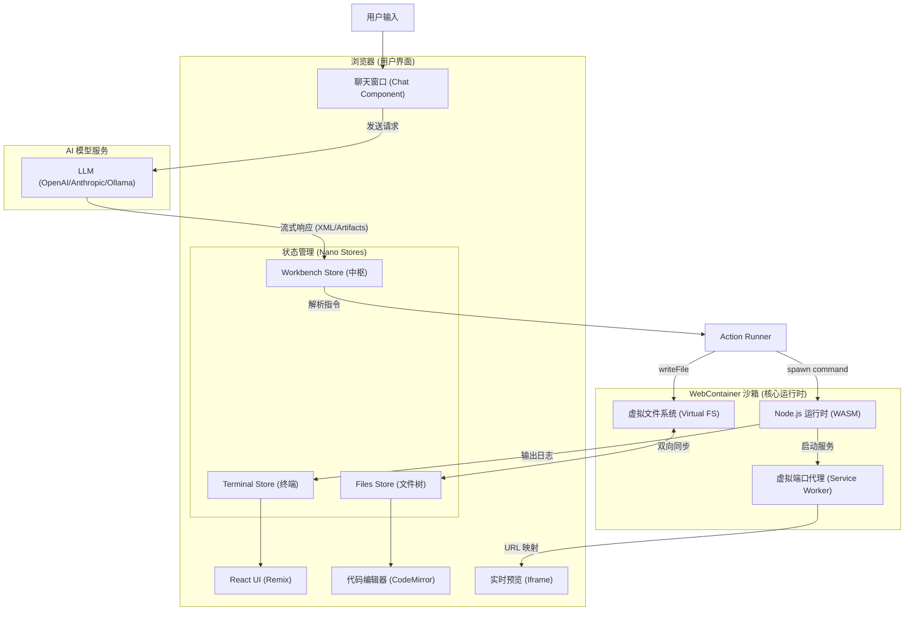
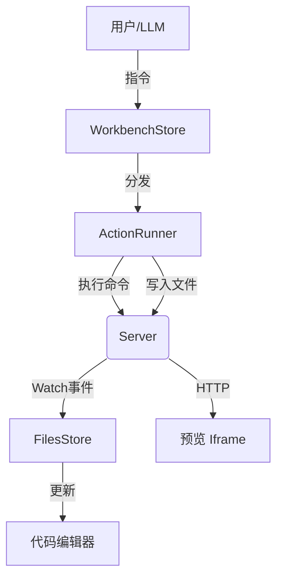

## 技术栈

*   **框架**: [Remix](https://remix.run/) (React) - 负责服务端渲染、路由管理及前后端协同。
*   **运行时沙箱**: [StackBlitz WebContainers](https://webcontainers.io/) - 在浏览器中运行 Node.js 的核心。
*   **状态管理**: [Nano Stores](https://github.com/nanostores/nanostores) - 轻量级、原子化的状态管理，适合流式更新。
*   **AI 调度**: [Vercel AI SDK](https://sdk.vercel.ai/) - 统一管理不同 LLM 供应商的流式接口。
*   **UI/样式**: [UnoCSS](https://unocss.dev/) & [Lucide Icons](https://lucide.dev/) - 极速且现代的样式方案。
*   **编辑器**: [CodeMirror 6](https://codemirror.net/) - 强大的 Web 代码编辑器。

## 顶层架构

  Bolt.diy 采用的是 Client-Side Heavy (重前端) 架构，极大地减轻了服务端压力。


   * **前端 (Frontend): ** 基于 Remix (React) 框架。这是用户交互、状态管理和 UI 渲染的主战场。
   * **运行时 (Runtime):**  StackBlitz WebContainers。这是它的“心脏”，一个运行在浏览器里的 Node.js 虚拟机。
   * **AI 调度层 (AI Orchestrator): ** Vercel AI SDK。负责连接各种 LLM（OpenAI, Anthropic, Ollama 等）并管理对话流。
   * **服务端 (Backend):** Remix 的 Loader/Action (运行在 Cloudflare Workers 或 Node.js 上)。主要负责 API 代理，隐藏 Key 等敏感信息，逻辑非常轻量。


## 目录结构

```text
bolt.diy/
├── app/                        # 应用核心 (Remix/React)
│   ├── components/             # UI 组件库
│   │   ├── @settings/          # 设置面板 (API Keys, 主题)
│   │   ├── chat/               # 聊天界面 (对话列表、输入框)
│   │   ├── editor/             # 代码编辑器 (CodeMirror 封装)
│   │   ├── workbench/          # 工作台 (Artifact 渲染、预览、终端)
│   │   └── ui/                 # 基础原子组件
│   ├── lib/                    # 业务逻辑与工具
│   │   ├── .server/            # 服务端逻辑 (LLM 供应商集成)
│   │   ├── common/             # 通用逻辑
│   │   │   └── prompts/        # 【核心】系统提示词 (Prompts)
│   │   ├── runtime/            # 【核心】执行层 (解析器、Action 运行器)
│   │   ├── stores/             # 【核心】全局状态管理 (Nano Stores)
│   │   └── webcontainer/       # WebContainer 初始化与监控
│   ├── routes/                 # 路由与 API 端点
│   │   ├── api.chat.ts         # 【核心】对话流 API
│   │   └── _index.tsx          # 首页入口
│   └── styles/                 # 全局样式 (Sass/UnoCSS)
├── electron/                   # 桌面端主进程逻辑
├── public/                     # 静态资源与注入脚本 (如 inspector-script.js)
├── docs/                       # 项目文档 (Markdown)
├── scripts/                    # 开发与构建辅助脚本
├── docker-compose.yaml         # Docker 编排配置
├── Dockerfile                  # 容器构建定义
├── package.json                # 依赖与脚本定义
├── vite.config.ts              # Vite 构建配置
└── wrangler.toml               # Cloudflare Pages 部署配置
```


## 核心流程

项目实现的核心逻辑可以概括为：**流式指令生成 -> 实时标签解析 -> 沙箱任务执行**。

### 提示词工程 (Prompt Engineering)
系统启动时会发送一个复杂的 `System Prompt`，它将 AI 塑造成一个“全栈工程师”。
*   **约束**：强制 AI 使用特定的 XML 结构（`<boltArtifact>`）来包裹输出。
*   **思考链**：要求 AI 在给出代码前先进行思考（CoT），提高复杂逻辑的准确性。

[[Bolt.diy Prompt Engineering]]


### 流式解析算法 (Streaming Parser)
代码位于 `app/lib/runtime/message-parser.ts`。
*   **状态机模式**：由于 AI 返回的是流式文本，标签可能会被中断。解析器能够识别“进行中”的标签。
*   **即时动作**：解析器不需要等待 AI 全部说毕，只要识别出 `<boltAction type="file">` 的起始，就可以开始在 UI 上创建文件占位符。

### Artifacts 与 Actions 机制
*   **Artifact**: 代表一个完整的任务单元（如“创建一个 React 组件”）。
*   **Action**: 是 Artifact 中的原子操作：
    *   `file`: 写入或修改文件内容。
    *   `shell`: 运行终端命令（npm install, git, 等）。


## 文件系统同步

`app/lib/stores/files.ts` 实现了浏览器状态与沙箱磁盘的强一致性。

- **Watcher 机制**：利用 WebContainer 的 `internal.watchPaths`。它不是轮询，而是基于事件的通知。
- **差异计算 (Diffing)**：项目会记录文件的原始版本。当用户保存文件或 AI 修改文件时，系统会计算 diff，这为未来的“撤销/重构”和“智能补丁”功能奠定了基础。
- **二进制处理**：内置 `istextorbinary` 检测。对于图片或编译产物，系统会跳过文本解码，避免 UI 崩溃。

## 沙箱

Bolt.diy 利用了 [StackBlitz WebContainers](https://webcontainers.io/) 技术，实现了在浏览器端运行完整 Node.js 环境的能力。

工作流程：
1. **指令接收**：AI 生成包含代码或命令的 Artifact。
2. **任务调度**：`WorkbenchStore` 将任务加入执行队列。
3. **沙箱操作**：`ActionRunner` 调用 WebContainer API 修改文件或运行命令。
4. **实时反馈**：沙箱内的文件变化、终端输出、预览错误实时回传并更新 UI。



## webcontainer

[StackBlitz WebContainers](https://webcontainers.io/) 是一项允许在浏览器中运行完整 Node.js 环境的技术。

- **WASM 运行环境**：将 Node.js 运行时编译为 WebAssembly，直接在浏览器进程中运行。
- **虚拟文件系统**：在浏览器内存中模拟 POSIX 文件系统，支持标准的文件读写操作。
- **Service Worker 网络代理**：利用 Service Worker 拦截请求，使得在沙箱内启动的 HTTP 服务器可以像真实服务器一样被预览。

- `app/lib/webcontainer/index.ts`：负责容器的初始化、安全策略配置和错误脚本注入。
- `app/lib/runtime/action-runner.ts`：负责将 AI 指令转化为具体的容器操作（文件读写、进程启动）。
- `app/lib/stores/files.ts`：通过监听容器文件系统变化，实现虚拟文件系统与 UI 文件树的同步。

### 替代方案思考

#### 远程 Docker/ K8S Pod

- **原理**：在云端服务器为每个用户启动一个独立的 Docker 容器或 K8s Pod。通过 WebSocket 实现终端和文件系统的远程同步。
- **优点**：
  - **全语言支持**：支持 Python, Java, Go, C++ 等任何能在 Linux 上运行的语言。
  - **性能强大**：不受浏览器性能限制，可按需配置高配 CPU/GPU。
  - **真实环境**：完美的 Linux 兼容性，无模拟层损耗。
- **缺点**：
  - **成本高昂**：需要为每位用户支付云服务器计算费用。
  - **延迟**：所有交互依赖网络连接。
#### Sandpack

- **Sandpack (CodeSandbox)**：一种轻量级的浏览器打包方案。
- **原理**：不在浏览器中运行 Node.js，而是重写了打包逻辑（如 Webpack/Vite 的部分功能）使其在浏览器运行。
- **场景**：非常适合 React/Vue 组件库文档演示，但不适合全栈应用开发。


## Remix

  - 从 app/root.tsx、app/routes/_index.tsx 看“路由与布局”是如何落地的。
  - 看 app/routes/api.chat.ts 这种 route module，理解 action/loader 与服务端逻辑如何写在同一个文件里。
  - 看 app/entry.client.tsx 和 app/entry.server.tsx，对应 Remix 的客户端/服务端入口文件约定。

