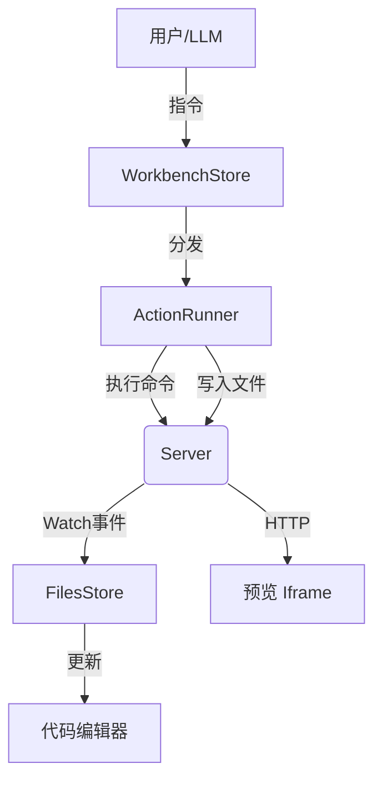

## 沙箱数据流转图

```mermaid
graph TD                                                                   
  User[用户/LLM] -->|指令| WorkbenchStore
  WorkbenchStore -->|分发| ActionRunner                                  
  ActionRunner -->|执行命令| WebContainer(Shell)
  ActionRunner -->|写入文件| WebContainer(FS)
  WebContainer(FS) -->|Watch事件| FilesStore
  FilesStore -->|更新| EditorUI[代码编辑器]                              
  WebContainer(Server) -->|HTTP| Preview[预览 Iframe]
```

